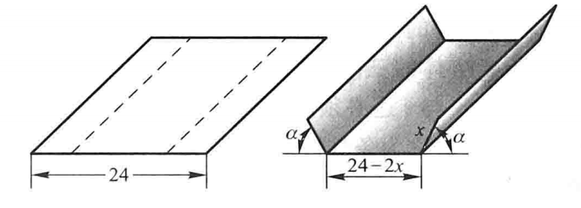

[回到主页面](index.html)

# 多元函数的微分

> [!tip]
> 
> 多元函数的微分是一元函数微分的推广, 它的一个非常重要的应用是求多元函数的极值. 例如 (P115例6) 有一块宽为 24cm 的方形铁板, 把它两边折起来做成一个断面为等腰梯形的水槽, 问怎样的折法才能使得截面面积最大? 设折出来的梯形底边长度为 $x$, 斜边的角度为 $\theta$, 则截面积可写成
> 
> $$
> S(x, \theta) = 24 x \sin\theta - 2x^2 \sin\theta + x^2 \sin\theta \cos\theta
> $$
> 
> 这是一个关于 $x, \theta$ 的二元函数, 如何求它的最大值呢?  我们可以带着这个问题开始本章的学习.

## 多元函数的连续性
> [!tip]
> 
> 在一元微积分中, 连续函数是我们的主要研究对象, 在多元微积分中同样也是这样. 下面我们先介绍一些准备知识作为铺垫, 然后给出多元函数极限和连续的定义.
> 

### 区域

> [!tip]
> 
> 在一元函数中, 我们经常**区间**的概念, 如开区间 $(a, b)$, 闭区间 $[a, b]$. **区域**是区间在高维空间中的推广. 下面我们以 $\mathbb{R}^2$ 为例进行介绍, 但所有的概念都可以推广到 $\mathbb{R}^n$ 中.
> 

> [!important]
> 
> ==邻域==
> 
> 设 $P_0(x, y)$ 是 $\mathbb{R}^2$ 中的一点, 给定 $\delta > 0$,  $\mathbb{R}^2$ 中所有与点 $P_0$ 距离小于 $\delta$ 的点构成一个集合, 称为点 $P_0$ 的 **$\delta$-邻域**, 记作 $U(P_0, \delta)$, 即
>  $$
>   U(P_0, \delta) = \{ (x, y)| \sqrt{(x-x_0)^2+ (y-y_0)^2} < \delta\}.
> $$
> 
> $P_0$ 与其自己的距离为0, 所以根据上述定义, $P_0\in U(P_0, \delta)$. 但有时候我们希望排除掉 $P_0$ 这一点, 在集合 $U(P_0, \delta)$ 中把 $P_0$ 去掉, 由此得到的集合称为 $P_0$ 的 **$\delta$-去心邻域**, 记作 $\overset{\circ}{U}(P_0, \delta)$, 即
>  $$
>  \overset{\circ}{U}(P_0, \delta) = \{ (x, y)| 0 < \sqrt{(x-x_0)^2+ (y-y_0)^2} < \delta\}.
> $$
>
> 有时候我们不关心 $\delta$ 的具体取值 (比如接下来的问题中), 往往简单用 $U(P_0)$ 和  $\overset{\circ}{U}(P_0)$ 分别表示 $P_0$ 的**邻域**和**去心邻域**.
> 

> [!important]
> 
> ==内点==
> 
> 任意给定一个 $\mathbb{R}^2$ 中的集合 $D$, 任意一点 $P$ 与 $D$ 的关系比符合以下三种关系中的一种:
> 
> 1. **内点**: 存在点 $P$ 的某个邻域 $U(P)$, 使得  $U(P) \subset D$.
> 2. **外点**: 存在点 $P$ 的某个邻域 $U(P)$, 使得  $U(P) \cap D = \emptyset$.
> 3. **边界点**: 点 $P$ 的任一邻域内既有属于 $D$ 的点, 又有不属于  $D$ 的点.
> 
> 集合 $D$ 的全体**边界点**所构成的集合称为 $D$ 的**边界**, 记作 $\partial D$.
> 

> [!note]
> 
> >**例**
> >
> >判断 $1 < x^2 + y^2 < 2$ 的内点, 外点和边界点.

> [!important]
> 
> ==聚点==
> 
> 对于点 $P$ 和点集 $E$,若对任意 $\delta > 0$,去心邻域 $ U^\circ(P, \delta) $ 内总包含 $E$ 中的点,则称 $P$ 是 $E$ 的**聚点**,
> 
> **注意**： 聚点 $P$ 可以**属于** $E$,也可以**不属于** $E$,
>

> [!note]
> 
> >**例**
> >
> >点集：$ E = \{ (x,y) \mid 1 < x^2 + y^2 \leq 2 \} $
> >
> >1. 内点：满足 $1 < x^2 + y^2 < 2$ 的所有点
> >2. 边界点：
> >  - $x^2 + y^2 = 1$ 的点（不属于 $E$）
> >  - $x^2 + y^2 = 2$ 的点（属于 $E$）
> >3. 聚点：$E$ 及其边界 $\partial E$ 上的所有点

> [!warning]
> 
> - 内点一定是聚点
> - 边界点可能是聚点
> - 聚点构成导集 $E'$,且 $\overline{E} = E \cup E'$
>

> [!important]
>
> ==开集与闭集==
>
> **开集**: 集合中的所有点都是其内点
> **闭集**: 集合的边界属于该集合, $\partial D \in D$
>

> [!note]
> 
> >**例**
> >
> >集合 $1 < x^2 + y^2 < 2$ 为开集.
> >

> [!important]
> 
> ==连通集==
> 
> 顾名思义, 如果集合 $D$ 中的任意两点都可以用折线连接起来, 且该折线上的点都属于 $D$, 则称 $D$ 为**连通集**.

> [!important]
> 
> ==区域==
> 
> **连通开集**称为**区域**(或**开区域**); 开区域连同它的边界一起所构成的集合称为**闭区域**.
> 

> [!note]
> 
> ==例子== 
> 
> 集合 $\{(x,y) \mid 1 < x^2 + y^2 < 2\}$ 是区域,而集合 $\{(x,y) \mid 1 \leq x^2 + y^2 \leq 2\}$ 是闭区域.

> [!important]
> 
> ==有界集与无界集==
> 
> >**有界集**  ： 对于平面点集 $E$,如果存在正数 $r$,使得$E \subset U(O, r)$,其中 $O$ 为坐标原点,则称 $E$ 为有界集,
> >**无界集** : 如果一个集合不是有界集,则称其为无界集,

### 多元函数的极限
> [!tip]
> 
> 下面我们以含有两个自变量的函数, 即二元函数为例引入多元函数及其极限的概念. 相关概念可以很容易推广到含有三个或更多自变量的多元函数中去.

> [!important]
> 
> ==二元函数的定义==
> 
>设 $D$ 是 $\mathbb{R}^2$ 中的非空子集,称映射 $f: D \to \mathbb{R}$ 为定义在 $D$ 上的**二元函数**,记为 
>$$
>z = f(x, y), \quad (x, y) \in D
>$$
>
>其中 $D$ 称为函数的**定义域** ,$x$ 和 $y$ 称为**自变量**.

>[!important]
>
> ==二元函数的极限==
> 
> 设 $f(x,y)$ 的定义在 $D$ 上的二元函数,$P_0(x_0, y_0)$ 是 $D$ 的聚点,如果存在常数 $A$,对于任意给定的正数 $\varepsilon$,总存在正数 $\delta$,使得当 $(x,y) \in U(P_0, \delta)$ 时,有 $ |f(x, y) - A| < \varepsilon $,则称 $A$ 为函数 $f(x,y)$ 当 $(x,y)$ 趋于 $(x_0, y_0)$ 时的极限,记作 
> $$
> \displaystyle\lim_{(x,y) \to (x_0, y_0)} f(x,y) = A.
> $$
>

> [!warning]
> 
> 注意从 $(x, y)$ 趋于 $(x_0, y_0)$ 有无数条路径, 极限存在要求**任意一条路径都成立**, 不能仅仅验证从 $x$-轴趋近和从$y$-轴趋近就断言极限存在.

>[!note]
>
> >**例1: 设 $f(x,y) = (x^2 + y^2)  \displaystyle\sin \frac{1}{x^2 + y^2}$,求证：$ \displaystyle\lim_{(x,y) \to (0,0)} f(x,y) = 0.$**
> > 
> >**证:**  这里函数 $f(x,y)$ 的定义域为 $D = \mathbb{R}^2 \backslash \{(0,0)\}$,点 $O(0,0)$ 为 $D$ 的聚点,
> > 因为$|f(x,y) - 0| = \displaystyle\left| (x^2 + y^2) \sin \displaystyle\frac{1}{x^2 + y^2} - 0 \right| \leq x^2 + y^2,$
> > 可见,$\forall \varepsilon > 0$,取 $\delta = \sqrt{\varepsilon}$,则当$ 0 < \sqrt{(x-0)^2 + (y-0)^2} < \delta,$ 
> > 即 $P(x,y) \in D \cap U(0,\delta)$ 时,总有 $|f(x,y) - 0| < \varepsilon$ 成立,所以 $  \displaystyle\lim_{(x,y) \to (0,0)} f(x,y) = 0. $
>
> >**例2: 考察函数在 $(0, 0)$ 处的极限, $$ f(x,y) = \begin{cases} \displaystyle\frac{xy}{x^2 + y^2}, & x^2 + y^2 \neq 0, \\0, & x^2 + y^2 = 0.\end{cases} $$.**
> > 
> >**解:** 首先, 我们看当点 $P(x,y)$ 沿 $x$ 轴趋于点 $(0,0)$ 时有,
> >$$
> >\lim_{x \to 0} f(x,0) = \lim_{x \to 0} 0 = 0
> >$$
> >又当点 $P(x,y)$ 沿 $y$ 轴趋于点 $(0,0)$ 时,
> >$$
> >\lim_{y \to 0} f(0,y) =  \lim_{y \to 0} 0 = 0.
> >$$
> >虽然以上述两种特殊方式（沿 $x$ 轴或沿 $y$ 轴）趋于原点时函数的极限存在且相等,但是不能以此断言该函数的极限存在. 例如, 当点 $P(x,y)$ 沿着直线 $y = kx$ 趋于点 $(0,0)$ 时,有
> >$$
> >\lim_{x \to 0} \frac{kx^2}{x^2 + k^2 x^2} = \frac{k}{1+k^2},
> >$$
> > $k$ 不同极限也不同, 由此可以断言函数在$(0, 0)$ 处的极限不存在.
> 
>
>>**例3: 求 $  \displaystyle\lim_{(x,y) \to (0,2)} \displaystyle\frac{\sin(xy)}{x} $.**
> >
> >**解:** 函数 $ \displaystyle\frac{\sin(xy)}{x} $ 的定义域为 $D = \{(x,y) | x \neq 0, y \in \mathbb{R}\}$,$P_0(0,2)$ 为 $D$ 的聚点,
> >$$
> >\displaystyle\lim_{(x,y) \to (0,2)} \displaystyle\frac{\sin(xy)}{x} =  \displaystyle\lim_{(x,y) \to (0,2)} \left[ \displaystyle\frac{\sin(xy)}{xy} \cdot y \right] =  \displaystyle\lim_{xy \to 0} \displaystyle\frac{\sin(xy)}{xy} \cdot \lim_{y \to 2} y = 1 \cdot 2=2
> >$$

### 多元函数的连续性
> [!tip]
> 
> 下面我们仍然以二元函数为例引入多元函数连续的概念. 相关概念可以很容易推广到含有三个或更多自变量的多元函数中去.
> 

> [!important]
> 
> ==二元函数连续性==
> 
> 设 $f(x, y)$ 为定义在 $D$ 上的二元函数,$P_0 (x_0, y_0)$ 为 $D$ 的聚点,且 $P_0 \in D$,如果 $ \displaystyle\lim_{(x,y) \to (x_0, y_0)} f(x, y) = f(x_0, y_0)$, 则称函数 $f(x, y)$ 在点 $P_0 (x_0, y_0)$ 连续,  
> 进一步, 如果函数 $f(x, y)$ 在 $D$ 内**每一点都连续**,则称函数 $f(x, y)$ 为 $D$ 上的**连续函数**,
> 
> ==间断点==
> 设函数 $f(x,y)$ 的定义域为 $D$,$P_0(x_0, y_0)$ 是 $D$ 的聚点,如果函数 $f(x,y)$ 在点 $P_0(x_0, y_0)$ **不连续**,那么称 $P_0(x_0, y_0)$ 为函数 $f(x,y)$ 的**间断点**,

> [!important]
>
> ==连续函数的性质==
>  
> 与**闭区间**上一元连续函数的性质相类似,在**有界闭区域**上连续的多元函数具有如下性质:
>
> - **性质1: 最大值与最小值**  
> 有界闭区域 $D$ 上的多元连续函数必定在 $D$ 上有界,且能取到它的最大值和最小值,
>
> - **性质2: 介值定理**  
> 有界闭区域 $D$ 上的多元连续函数能取到介于最大值和最小值之间的任何值,
>

## 偏导数
> [!tip]
> 固定其它变量, 看一个变量变化对函数值的影响.

> [!important]
> ==偏导数==
> 设函数 $z=f(x,y)$ 在点 $(x_0,y_0)$ 的某一邻域内有定义,固定 $y=y_0$ 让 $x$ 在 $x_0$ 附近变化, 若极限  
> $$
> \displaystyle\lim_{\Delta x \to 0} \displaystyle\frac{f(x_0 + \Delta x, y_0) - f(x_0, y_0)}{\Delta x} \tag{2-1} 
> $$
> 存在, 则称此极限为函数 $z=f(x,y)$ 在点 $(x_0,y_0)$ 处对 $x$ 的**偏导数**,记作：  
> $$
> \left. \displaystyle\frac{\partial z}{\partial x} \right|_{x=x_0}, \quad \left. \displaystyle\frac{\partial f}{\partial x} \right|_{x=x_0}, \quad z_x \bigg|_{x=x_0} \text{ 或 } f_x(x_0, y_0)
> $$
> 
> 类似地, 函数 $z=f(x,y)$ 对 $y$ 的偏导数为：  
> $$
> \displaystyle\lim_{\Delta y \to 0} \displaystyle\frac{f(x_0, y_0 + \Delta y) - f(x_0, y_0)}{\Delta y} 
> $$
> 记作：  
> $$
> \displaystyle\left. \displaystyle\frac{\partial z}{\partial y} \right|_{y=y_0}, \quad \left. \displaystyle\frac{\partial f}{\partial y} \right|_{y=y_0}, \quad z_y \bigg|_{y=y_0} \text{ 或 } f_y(x_0, y_0)
> $$
> 

> [!warning]
> ==偏导函数== 
> 若 $z=f(x,y)$ 在区域 $D$ 内每一点 $(x,y)$ 处对 $x$ 的偏导数存在, 则由此构成的函数称为**偏导函数**,记作：  
>$$
>\displaystyle\frac{\partial z}{\partial x}, \quad \displaystyle\frac{\partial f}{\partial x}, \quad z_x \text{ 或 } f_x(x, y)
>$$
> 对 $y$ 的偏导函数记为：  
> $$
> \displaystyle\frac{\partial z}{\partial y}, \quad \displaystyle\frac{\partial f}{\partial y}, \quad z_y \text{ 或 } f_y(x, y)
> $$

>[!note]
>
> >**例1:求分段函 $
> >z = f(x, y) = 
> >\displaystyle\begin{cases} 
> >\displaystyle\frac{xy}{x^2 + y^2}, & x^2 + y^2 \neq 0 \\
> >0, & x^2 + y^2 = 0 
> >\end{cases}$ 在点 (0,0) 处的偏导数.**
> >
> >**解:**
> >
> > - 计算 $f_x(0, 0)$  
> > 
> > $f_x(0, 0) =  \displaystyle\lim_{\Delta x \to 0} \displaystyle\frac{f(0+\Delta x, 0) - f(0, 0)}{\Delta x} =  \displaystyle\lim_{\Delta x \to 0} \displaystyle\frac{0 - 0}{\Delta x} = 0$
> > 
> > - 计算 $f_y(0, 0)$  
> >
> > $f_y(0, 0) =  \displaystyle\lim_{\Delta y \to 0} \displaystyle\frac{f(0, 0+\Delta y) - f(0, 0)}{\Delta y} =  \displaystyle\lim_{\Delta y \to 0} \displaystyle\frac{0 - 0}{\Delta y} = 0$

>[!important]
>
>==高阶偏导数==
>
> 对偏导函数再求偏导数称为**二阶偏导数**, 以此类推还有三阶偏导数和更高阶的偏导数.
>

> [!warning]
> 
> ==二阶偏导数的四种形式==
>
>1. 对 $x$ 的二阶偏导：
>$$ \displaystyle\displaystyle\frac{\partial}{\partial x} \left( \displaystyle\frac{\partial z}{\partial x} \right) = \displaystyle\frac{\partial^2 z}{\partial x^2} = f_{xx}(x, y) $$
>
>2. 先对 $x$ 后对 $y$ 的混合偏导：
>$$ \displaystyle\frac{\partial}{\partial y} \left( \displaystyle\frac{\partial z}{\partial x} \right) = \displaystyle\frac{\partial^2 z}{\partial x \partial y} = f_{xy}(x, y) $$
>
>3. 先对 $y$ 后对 $x$ 的混合偏导：
>$$ \displaystyle\frac{\partial}{\partial x} \left( \displaystyle\frac{\partial z}{\partial y} \right) = \displaystyle\frac{\partial^2 z}{\partial y \partial x} = f_{yx}(x, y) $$
>
>4. 对 $y$ 的二阶偏导：
>$$ \displaystyle\frac{\partial}{\partial y} \left( \displaystyle\frac{\partial z}{\partial y} \right) = \displaystyle\frac{\partial^2 z}{\partial y^2} = f_{yy}(x, y) $$

>[!note]
>
> >**例：设函数 $z = x^3 y^2 - 3xy^3 - xy + 1$,求下列高阶偏导数：
> >$$ \displaystyle\frac{\partial^2 z}{\partial x^2},\ \displaystyle\frac{\partial^2 z}{\partial y \partial x},\ \displaystyle\frac{\partial^2 z}{\partial x \partial y},\ \displaystyle\frac{\partial^2 z}{\partial y^2} \ \text{及}\ \displaystyle\frac{\partial^3 z}{\partial x^3} .$$**
> >
> >**解:**  
> >先求一阶偏导数:
> >$ \displaystyle\frac{\partial z}{\partial x} = 3x^2 y^2 - 3y^3 - y $
> >$ \displaystyle\frac{\partial z}{\partial y} = 2x^3 y - 9xy^2 - x $
> >然后求二阶偏导数：
> >$ \displaystyle\frac{\partial^2 z}{\partial x^2} = \displaystyle\frac{\partial}{\partial x}(3x^2 y^2 - 3y^3 - y) = 6xy^2 $
> >$ \displaystyle\frac{\partial^2 z}{\partial y \partial x} = \displaystyle\frac{\partial}{\partial y}(3x^2 y^2 - 3y^3 - y) = 6x^2 y - 9y^2 - 1 $
> >$ \displaystyle\frac{\partial^2 z}{\partial x \partial y} = \displaystyle\frac{\partial}{\partial x}(2x^3 y - 9xy^2 - x) = 6x^2 y - 9y^2 - 1 $
> >$ \displaystyle\frac{\partial^2 z}{\partial y^2} = \displaystyle\frac{\partial}{\partial y}(2x^3 y - 9xy^2 - x) = 2x^3 - 18xy $
> >最后求三阶偏导数
> >$ \displaystyle\frac{\partial^3 z}{\partial x^3} = \displaystyle\frac{\partial}{\partial x}(6xy^2) = 6y^2 $

>[!important]
>
>==二阶混合偏导数定理==
>
> 如果函数 $z = f(x, y)$ 的二阶混合偏导数  $ \displaystyle\frac{\partial^2 z}{\partial y \partial x} \quad \text{和} \quad \displaystyle\frac{\partial^2 z}{\partial x \partial y} $  在区域 $D$ 内连续,那么在该区域内必有： 
> $$
> \displaystyle\frac{\partial^2 z}{\partial y \partial x} = \displaystyle\frac{\partial^2 z}{\partial x \partial y}
> $$
> 
> 即：**二阶混合偏导数在连续条件下与求导次序无关**,  

> [!note]
>
> >**例1:验证函数 $z = \ln \sqrt{x^2 + y^2}$ 满足拉普拉斯方程 $$ \displaystyle\frac{\partial^2 z}{\partial x^2} + \displaystyle\frac{\partial^2 z}{\partial y^2} = 0 .$$**
> >
> >**证明:**   
> >首先将函数化简为：
> >$$ z = \displaystyle\frac{1}{2} \ln(x^2 + y^2) $$  
> >$$ \displaystyle\frac{\partial z}{\partial x} = \displaystyle\frac{x}{x^2 + y^2} $$
> >$$ \displaystyle\frac{\partial z}{\partial y} = \displaystyle\frac{y}{x^2 + y^2} $$
> >$$ \displaystyle\frac{\partial^2 z}{\partial x^2} = \displaystyle\frac{y^2 - x^2}{(x^2 + y^2)^2} $$
> >$$ \displaystyle\frac{\partial^2 z}{\partial y^2} = \displaystyle\frac{x^2 - y^2}{(x^2 + y^2)^2} $$
> >验证方程 
> >将二阶偏导数相加：
> >$$ \displaystyle\frac{\partial^2 z}{\partial x^2} + \displaystyle\frac{\partial^2 z}{\partial y^2} = \displaystyle\frac{y^2 - x^2 + x^2 - y^2}{(x^2 + y^2)^2} = 0 $$
>
>
> >**例2:证明函数 $u = \dfrac{1}{r}$ 满足拉普拉斯方程$$ \displaystyle\frac{\partial^2 u}{\partial x^2} + \displaystyle\frac{\partial^2 u}{\partial y^2} + \displaystyle\frac{\partial^2 u}{\partial z^2} = 0 $$,其中 $r = \sqrt{x^2 + y^2 + z^2}$.**
> >
> >**证明:**
> > $$ \displaystyle\frac{\partial u}{\partial x} = -\displaystyle\frac{1}{r^2} \cdot \displaystyle\frac{\partial r}{\partial x} = -\displaystyle\frac{x}{r^3} $$
> > $$ \displaystyle\frac{\partial^2 u}{\partial x^2} = -\displaystyle\frac{1}{r^3} + \displaystyle\frac{3x^2}{r^5} $$
> >  由对称性可得：
> >  $$ \displaystyle\frac{\partial^2 u}{\partial y^2} = -\displaystyle\frac{1}{r^3} + \displaystyle\frac{3y^2}{r^5}, \quad \displaystyle\frac{\partial^2 u}{\partial z^2} = -\displaystyle\frac{1}{r^3} + \displaystyle\frac{3z^2}{r^5} $$
> >验证方程  
> >  $$ \begin{aligned}
> >  \displaystyle\frac{\partial^2 u}{\partial x^2} + \displaystyle\frac{\partial^2 u}{\partial y^2} + \displaystyle\frac{\partial^2 u}{\partial z^2} 
> >  &= -\displaystyle\frac{3}{r^3} + \displaystyle\frac{3(x^2 + y^2 + z^2)}{r^5} \\&= -\displaystyle\frac{3}{r^3} + \displaystyle\frac{3r^2}{r^5} \\ &= 0 \end{aligned} $$

## 全微分

> [!tip]
> 
> 在学习全微分的知识之前, 我们来回顾一下**一元函数微分**, 对于函数 $y=f(x)$, 其增量可表示为:
> 
> $$
> df = f'(x)dx
> $$
> 
> 接下来我们要把上述关系推广多元函数, 从而将函数值的变化于自变量的变化联系起来.
> 

> [!important]
> 
> ==全微分公式==
> 
> $$
> dz = \displaystyle\frac{\partial z}{\partial x}dx + \displaystyle\frac{\partial z}{\partial y}dy 
> $$
> 

> [!warning]
>
> ==全微分的几何理解==
> 
> 
> 

> [!important]
> 
> ==三元函数全微分==
> 
>$$
>df = \left( \frac{\partial f}{\partial x}, \frac{\partial f}{\partial y}, \frac{\partial f}{\partial z} \right)^T \cdot \left( dx, dy, dz \right)^T
>$$

>[!note]
>
> >**例1:$ z(x,y) = x + y $.**
> >
> >**解:**
> >变量变化：$x \to x + \Delta x, \quad y \to y + \Delta y$
> >函数增量计算： $z(x + \Delta x, y + \Delta y) = (x + \Delta x) + (y + \Delta y)$
> >增量分解： $\Delta z = z(x + \Delta x, y + \Delta y) - z(x, y) = \Delta x + \Delta y$
> >偏导数表示：  $\displaystyle\frac{\partial z}{\partial x} = 1, \quad \displaystyle\frac{\partial z}{\partial y} = 1$
> >全微分公式：  $dz = dx + dy$
> 
>
> >**例2:函数 $z(x,y) = x^2 + 2y^3$.**
> >
> >**解:** 
> >考虑自变量的微小变化：
> >$
> >\begin{cases}
> >x \rightarrow x + dx \\ 
> >y \rightarrow y + dy
> >\end{cases}
> >$
> >函数增量计算： $\begin{aligned}
> >z(x+dx,y+dy) &= (x+dx)^2 + 2(y+dy)^3 \\
> >&= x^2 + 2xdx + dx^2 + 2(y^3 + 3y^2dy + 3ydy^2 + dy^3) \\
> >&= x^2 + 2y^3 + 2xdx + 6y^2dy + \underbrace{dx^2 + 6ydy^2 + 2dy^3}_{\text{高阶无穷小项}}
> >\end{aligned} $
> >线性主部提取： 保留一阶增量项
> >$
> >\Delta z \approx 2xdx + 6y^2dy
> >$
> >偏导数计算：
> >$
> >\displaystyle\frac{\partial z}{\partial x} = 2x \quad \text{和} \quad \displaystyle\frac{\partial z}{\partial y} = 6y^2
> >$
> >全微分公式：$
> >dz = \displaystyle\frac{\partial z}{\partial x}dx + \displaystyle\frac{\partial z}{\partial y}dy = 2xdx + 6y^2dy$
>
>
> >**例3:$ S = \displaystyle\frac{1}{2} \left( L - 2x + L - 2x + 2x \cos \theta \right) x \sin \theta $.**
> >
> >**解:**
> >化简：$ S(x, \theta) = L x \sin \theta - 2x^2 \sin \theta + x^2 \sin \theta \cos \theta $
> >变量代换过程：$ x \to x + \Delta x, \quad \theta \to \theta + \Delta \theta $
> >函数增量展开：
> >$ 
> >\begin{aligned}
> S(x+\Delta x, \theta+\Delta \theta) &= L (x+\Delta x) \sin(\theta+\Delta \theta) \\
> &\quad -2(x+\Delta x)^2 \sin(\theta+\Delta \theta) \\
> &\quad + (x+\Delta x)^2 \sin(\theta+\Delta \theta)\cos(\theta+\Delta \theta)
> \end{aligned}
> >$
> >线性近似处理（保留一阶项）：
> >$
> >\begin{aligned}
> >\Delta S &\approx (L \sin \theta - 4x \sin \theta + 2x \sin \theta \cos \theta)\Delta x \\
> >&\quad + (L x \cos \theta - 2x^2 \cos \theta - x^2 \sin^2 \theta + x^2 \cos^2 \theta)\Delta \theta
> >\end{aligned}$
> >偏导数提取：
> >$
> >\begin{cases}
> >\displaystyle\frac{\partial S}{\partial x} = L \sin \theta - 4x \sin \theta + x \sin \theta \cos \theta \\
> >\displaystyle\frac{\partial S}{\partial \theta} = L x \cos \theta - 2x^2 \cos \theta + x^2 (\cos^2 \theta - \sin^2 \theta)
> >\end{cases}$
> >全微分公式：$dS = \displaystyle\frac{\partial S}{\partial x}dx + \displaystyle\frac{\partial S}{\partial \theta}d\theta$
> >最终结果：$dS = \sin\theta (L - 4x + 2x \cos\theta)dx + [x \cos\theta (L - 2x) + x^2 \cos 2\theta]d\theta$

### 多元复合函数求导的链式法则

>[!note]
>
> >**例: $f(x, y) = \sin(x^2 + y) + \cos(x + y^2)$.**
> >
> >$
> >\begin{cases} 
> >2x \cos(x^2 + y) - \sin(x + y^2) = 0 \\ 
> >\cos(x^2 + y) - 2y \sin(x + y^2) = 0 
> >\end{cases}
> >$

## 隐函数求导

>[!tip]
>
> **复习：直接求导法**
> 给定隐函数方程：$ x + \cos y = xy $
>  两边对$x$求导: $ \displaystyle\frac{d}{dx}(x) + \displaystyle\frac{d}{dx}(\cos y) = \displaystyle\frac{d}{dx}(xy) $
>  逐项计算：$ 1 - \sin y \cdot y' = y + x y' $
>  解出$y'$：$ y' = \displaystyle\frac{1 - y}{\sin y + x} $
>
> **全微分法（更通用的方法）**
> 
> 将方程改写为：$ F(x,y) = x + \cos y - xy = 0 $
> 
> **求导原理**：
>  计算全微分：$ dF = \displaystyle\frac{\partial F}{\partial x}dx + \displaystyle\frac{\partial F}{\partial y}dy = 0 $
>  求出偏导数：$ \displaystyle\frac{\partial F}{\partial x} = 1 - y $ ,  $ \displaystyle\frac{\partial F}{\partial y} = -\sin y - x $
> 根据隐函数定理：$ \displaystyle\frac{dy}{dx} = -\displaystyle\frac{\displaystyle\frac{\partial F}{\partial x}}{\displaystyle\frac{\partial F}{\partial y}} = \displaystyle\frac{1 - y}{\sin y + x} $
> 
>**两种方法对比**
> | 方法       | 优点               | 缺点               |
> |------------|--------------------|--------------------|
> | 直接求导法 | 步骤直观           | 需显式处理$y$的函数性 |
> | 全微分法   | 通用性强,适合多变量 | 需计算偏导数        |
>
> >**公式推导**  
> >由 $F(x,y,f(x,y)) \equiv 0$ 两边求导：
> >1. 对 $x$ 求导：$ F_x + F_z \displaystyle\frac{\partial z}{\partial x} = 0 \ \Rightarrow\ \displaystyle\frac{\partial z}{\partial x} = -\displaystyle\frac{F_x}{F_z} $
> >2. 对 $y$ 求导：$ F_y + F_z \displaystyle\frac{\partial z}{\partial y} = 0 \ \Rightarrow\ \displaystyle\frac{\partial z}{\partial y} = -\displaystyle\frac{F_y}{F_z} $

>[!note]
>
> >**例1:给定隐函数方程：$F(x, y, z) = 0 $,（也可以成 $z = z(x, y)$） 求以下两个偏导数：$ \displaystyle\frac{\partial z}{\partial x} $,$ \displaystyle\frac{\partial z}{\partial y} $.**
> >
> >**解:**
> > 对$x$求偏导： $ \displaystyle\frac{\partial F}{\partial x} + \displaystyle\frac{\partial F}{\partial z} \displaystyle\frac{\partial z}{\partial x} = 0 $
> > 对$y$求偏导： $ \displaystyle\frac{\partial F}{\partial y} + \displaystyle\frac{\partial F}{\partial z} \displaystyle\frac{\partial z}{\partial y} = 0 $
> > 最终公式: $ \displaystyle\frac{\partial z}{\partial x} = -\displaystyle\frac{\displaystyle\frac{\partial F}{\partial x}}{\displaystyle\frac{\partial F}{\partial z}} $ , $ \displaystyle\frac{\partial z}{\partial y} = -\displaystyle\frac{\displaystyle\frac{\partial F}{\partial y}}{\displaystyle\frac{\partial F}{\partial z}} $
>
> >**例2:给定隐函数方程：$ x^2 + y^2 + z^2 - 4z = 0 $,求 $ \displaystyle\frac{\partial^2 z}{\partial x^2}$.**
> >
> >**解:**一阶偏导数计算：$ \displaystyle\frac{\partial z}{\partial x} = -\displaystyle\frac{x}{z-2} $
> >二阶偏导数推导：
> >对一阶导结果再次求导： $ \displaystyle\frac{\partial^2 z}{\partial x^2} = \displaystyle\frac{d}{dx}\left( -\displaystyle\frac{x}{z-2} \right) $
> >应用商的导数法则：$ = -\displaystyle\frac{(1)(z-2) - x\displaystyle\frac{\partial z}{\partial x}}{(z-2)^2} $
> >代入$\displaystyle\frac{\partial z}{\partial x}$ 得$-\displaystyle\frac{(z-2) - x\left(-\displaystyle\frac{x}{z-2}\right)}{(z-2)^2} $ $ = \displaystyle\frac{2 - z - \displaystyle\frac{x^2}{z-2}}{(z-2)^2} $
>
>
> >**例3:给定两个隐函数方程：
> >$ 
> >\begin{cases}
> >P = F(x, y, u, v) = 0 \\
> >q = Q(x, y, u, v) = 0 
> >\end{cases}
> >$  需要求解的偏导数矩阵：$ 
> >\begin{pmatrix}
> >\displaystyle\frac{\partial u}{\partial x} & \displaystyle\frac{\partial u}{\partial y} \\
> >\displaystyle\frac{\partial v}{\partial x} & \displaystyle\frac{\partial v}{\partial y}
> >\end{pmatrix}
> >$**
> >
> >**解:**
> >对每个方程求全微分： $ 
> >\begin{cases}
> >dF = F_x dx + F_y dy + F_u du + F_v dv = 0 \\
> >dG = G_x dx + G_y dy + G_u du + G_v dv = 0 
> >\end{cases}
> >$
> >整理成矩阵形式：
> >$ 
> >\begin{pmatrix}
> >F_u & F_v \\
> >G_u & G_v 
> >\end{pmatrix}
> >\begin{pmatrix}
> >\displaystyle\frac{\partial u}{\partial x} \\
> >\displaystyle\frac{\partial v}{\partial x}
> >\end{pmatrix}
> >= -
> >\begin{pmatrix}
> >F_x \\
> >G_x 
> >\end{pmatrix}
> >$
> >解得：
> >$
> >\begin{pmatrix}
> >\displaystyle\frac{\partial u}{\partial x} \\
> >\displaystyle\frac{\partial v}{\partial x}
> >\end{pmatrix}
> >= -
> >\begin{pmatrix}
> >F_u & F_v \\
> >G_u & G_v 
> >\end{pmatrix}^{-1}
> >\begin{pmatrix}
> >F_x \\
> >G_x 
> >\end{pmatrix}
> >$
>
>
> >**例4：$
> > \begin{cases}
> > xu - yv = 0 \\
> > yu + xv = 1
> > \end{cases}
> > $ 求对函数 $u(x,y)$ 和 $v(x,y)$ 的偏导数$ u_x,u_y,v_x,v_y$.**
> > 
> > **解：**
> > 第一个方程对$x$求导：$ u + x\displaystyle\frac{\partial u}{\partial x} - y\displaystyle\frac{\partial v}{\partial x} = 0 $
> >  第二个方程对$x$求导：$y\displaystyle\frac{\partial u}{\partial x} + v + x\displaystyle\frac{\partial v}{\partial x} = 0 $
> > 整理成方程组：$
> > \begin{cases}
> > xu_x - yv_x = -u \\
> > yu_x + xv_x = -v
> > \end{cases}
> > $
> >从第一式解出： $ u_x = \displaystyle\frac{yv_x - u}{x} $
> > 代入第二式：$ y\left(\displaystyle\frac{yv_x - u}{x}\right) + v + xv_x = 0 $
> > 化简得：$ (x^2 + y^2)v_x = yu - xv $
> >最终解：$ v_x = \displaystyle\frac{yu - xv}{x^2 + y^2} $
>
>
> >**例5:给定约束方程组：
> > $ F = x - \rho\cos\theta = 0 $,
> > $ G = y - \rho\sin\theta = 0 $.**
> >
> >[此题有问题，请检阅]
> >**解:** 约束函数的雅可比矩阵（对变量 $x, y, \rho, \theta$ 求偏导）为：
> >$J =
> >\begin{bmatrix}
> >\displaystyle\frac{\partial F}{\partial x} & \displaystyle\frac{\partial F}{\partial y} & \displaystyle\frac{\partial F}{\partial \rho} & \displaystyle\frac{\partial F}{\partial \theta} \\
> >\displaystyle\frac{\partial G}{\partial x} & \displaystyle\frac{\partial G}{\partial y} & \displaystyle\frac{\partial G}{\partial \rho} & \displaystyle\frac{\partial G}{\partial \theta}
> >\end{bmatrix}=
> >\begin{bmatrix}
> >1 & 0 & -\cos\theta & \rho \sin\theta \\
> >0 & 1 & -\sin\theta & -\rho \cos\theta
> >\end{bmatrix}$
>
>
> >**例6:设 $u = f(x,y)$ 的所有二阶偏导数连续,将下列表达式转换为极坐标形式： 
> > (1) $\left( \dfrac{\partial u}{\partial x} \right)^2 + \left( \dfrac{\partial u}{\partial y} \right)^2$ 
> > (2) $\dfrac{\partial^2 u}{\partial x^2} + \dfrac{\partial^2 u}{\partial y^2}$.**
> >
> >**解:**  
> > 由极坐标关系 $\rho = \sqrt{x^2+y^2}$, $\theta = \arctan(y/x)$,通过链式法则：
> > $$ \displaystyle\frac{\partial u}{\partial x} = \displaystyle\frac{\partial u}{\partial \rho}\cos\theta - \displaystyle\frac{\partial u}{\partial \theta}\displaystyle\frac{\sin\theta}{\rho} $$
> > $$ \displaystyle\frac{\partial u}{\partial y} = \displaystyle\frac{\partial u}{\partial \rho}\sin\theta + \displaystyle\frac{\partial u}{\partial \theta}\displaystyle\frac{\cos\theta}{\rho} $$
> > $$ \left(\displaystyle\frac{\partial u}{\partial x}\right)^2 + \left(\displaystyle\frac{\partial u}{\partial y}\right)^2 = \left(\displaystyle\frac{\partial u}{\partial \rho}\right)^2 + \displaystyle\frac{1}{\rho^2}\left(\displaystyle\frac{\partial u}{\partial \theta}\right)^2 $$
> > $\displaystyle\frac{\partial^2 u}{\partial x^2}$展开：
> > $$ \begin{aligned}
> > \displaystyle\frac{\partial^2 u}{\partial x^2} &= \displaystyle\frac{\partial^2 u}{\partial \rho^2}\cos^2\theta - \displaystyle\frac{\partial^2 u}{\partial \rho \partial \theta}\sin 2\theta + \displaystyle\frac{\partial^2 u}{\partial \theta^2}\displaystyle\frac{\sin^2\theta}{\rho^2} \\
> > &\quad + \displaystyle\frac{\partial u}{\partial \theta}\displaystyle\frac{\sin 2\theta}{\rho^2} + \displaystyle\frac{\partial u}{\partial \rho}\displaystyle\frac{\sin^2\theta}{\rho}
> > \end{aligned} $$
> > $\displaystyle\frac{\partial^2 u}{\partial y^2}$展开：
> > $$ \begin{aligned}
> > \displaystyle\frac{\partial^2 u}{\partial y^2} &= \displaystyle\frac{\partial^2 u}{\partial \rho^2}\sin^2\theta + \displaystyle\frac{\partial^2 u}{\partial \rho \partial \theta}\sin 2\theta + \displaystyle\frac{\partial^2 u}{\partial \theta^2}\displaystyle\frac{\cos^2\theta}{\rho^2} \\
> > &\quad - \displaystyle\frac{\partial u}{\partial \theta}\displaystyle\frac{\sin 2\theta}{\rho^2} + \displaystyle\frac{\partial u}{\partial \rho}\displaystyle\frac{\cos^2\theta}{\rho}
> > \end{aligned} $$
> > 两式相加后化简得极坐标下的拉普拉斯算子：
> > $$ \displaystyle\frac{\partial^2 u}{\partial x^2} + \displaystyle\frac{\partial^2 u}{\partial y^2} = { \displaystyle\frac{\partial^2 u}{\partial \rho^2} + \displaystyle\frac{1}{\rho}\displaystyle\frac{\partial u}{\partial \rho} + \displaystyle\frac{1}{\rho^2}\displaystyle\frac{\partial^2 u}{\partial \theta^2} } $$
> >或等价表示为：
> > $$ { \displaystyle\frac{1}{\rho}\displaystyle\frac{\partial}{\partial \rho}\left(\rho \displaystyle\frac{\partial u}{\partial \rho}\right) + \displaystyle\frac{1}{\rho^2}\displaystyle\frac{\partial^2 u}{\partial \theta^2} } $$

## 方向导数
>[!important]
>**方向导数的定义**
>设函数 $f(x,y,z)$ 在点 $P_0(x_0,y_0,z_0)$ 的某邻域内有定义,$\mathbf{l}$ 为从 $P_0$ 出发的给定方向向量,$P(x,y,z)$ 为 $\mathbf{l}$ 上邻近 $P_0$ 的点,若极限  
>$$
> \displaystyle\lim_{\rho \to 0^+} \frac{f(P) - f(P_0)}{\rho} = \left. \frac{\partial f}{\partial l} \right|_{P_0}
>$$
>存在,则称此极限为 $f$ 在 $P_0$ 点沿方向 $\mathbf{l}$ 的**方向导数**,其中 $\rho = |PP_0|$,
>**计算公式** 
>当 $f$ 在 $P_0$ 点可微时,方向导数可通过梯度计算：  
>$$ \left. \displaystyle\frac{\partial f}{\partial l} \right|_{P_0} = \nabla f(P_0) \cdot \mathbf{l}^0 = \left( \displaystyle\frac{\partial f}{\partial x}, \displaystyle\frac{\partial f}{\partial y}, \displaystyle\frac{\partial f}{\partial z} \right) \cdot (cos\alpha, cos\beta, cos\gamma) $$
>其中 $\mathbf{l}^0 = (cos\alpha, cos\beta, cos\gamma)$ 为单位方向向量,
>**几何意义**
>方向导数表示函数沿 $\mathbf{l}$ 方向的瞬时变化率：
>
>- 当 $\nabla f$ 与 $\mathbf{l}$ 同向时取最大值 $|\nabla f|$
>- 当 $\nabla f$ 与 $\mathbf{l}$ 反向时取最小值 $-|\nabla f|$
>- 当 $\nabla f \perp \mathbf{l}$ 时方向导数为零

>[!important]
> **方向导数存在定理**  
> 若函数 $f(x,y)$ 在点 $P_0(x_0,y_0)$ 可微分,则沿任一方向 $\mathbf{l}$ 的方向导数存在,且满足：  
> $$
> \frac{\partial f}{\partial l} \bigg|_{(x_0,y_0)} = f_x(x_0,y_0) \cos\alpha + f_y(x_0,y_0) \cos\beta
> $$
> 其中 $\cos\alpha$、$\cos\beta$ 为方向 $\mathbf{l}$ 的方向余弦,  
> **证明**  
> 由 $f(x,y)$ 在 $(x_0,y_0)$ 可微：  
> $$
> \begin{aligned}
> &f(x_0+\Delta x, y_0+\Delta y) - f(x_0,y_0) \\
> &= f_x(x_0,y_0) \Delta x + f_y(x_0,y_0) \Delta y + o\left(\sqrt{(\Delta x)^2 + (\Delta y)^2}\right).
> \end{aligned}
> $$
> 当 $(x_0+\Delta x, y_0+\Delta y)$ 沿方向 $\mathbf{l}$ 变化时（设 $\Delta x = t\cos\alpha$, $\Delta y = t\cos\beta$, $t \to 0$）：  
> $$
>  \displaystyle\frac{\partial f}{\partial l} = \lim_{t \to 0} \frac{f(x_0+t\cos\alpha, y_0+t\cos\beta) - f(x_0,y_0)}{t} = f_x(x_0,y_0) \cos\alpha + f_y(x_0,y_0) \cos\beta.
> $$

>[!note]
>
> >**例1:求函数$ z = xe^{2y} $ 在点 $P(1,0) $ 沿 $ P \rightarrow Q(2,-1) $ 方向的方向导数.**
> >
> >**解:**方向向量 $\vec{PQ} = (1,-1) $,单位化得：  $$ \vec{n} = \displaystyle\frac{1}{\sqrt{2}}(1,-1)^T $$ 
> >
> > - $ \left.\dfrac{\partial z}{\partial x}\right|_{(1,0)} = e^{2y}\big|_{(1,0)} = 1 $
> > - $ \left.\dfrac{\partial z}{\partial y}\right|_{(1,0)} = 2xe^{2y}\big|_{(1,0)} = 2 $
> >$
> >\left.\dfrac{\partial z}{\partial l}\right|_{(1,0)} = \nabla z \cdot \vec{n} = \displaystyle\frac{1}{\sqrt{2}} - \displaystyle\frac{2}{\sqrt{2}} = { -\dfrac{1}{\sqrt{2}} }
> >$
>
> >**例2:求函数 $ f(x,y,z) = xy + yz + zx $ 在点 $(1,1,2) $ 沿方向 $ l $ 的方向导数,方向角为 $ 60^\circ, 45^\circ, 60^\circ $.**
> >
> >**解:** 单位方向向量：$ \mathbf{e}_l = \left( \cos 60^\circ, \cos 45^\circ, \cos 60^\circ \right) = { \left( \displaystyle\frac{1}{2}, \displaystyle\frac{\sqrt{2}}{2}, \displaystyle\frac{1}{2} \right) } $ 
> >$
> >  \begin{aligned}
> >  f_x(1,1,2) &= (y+z)\big|_{(1,1,2)} = 3 \\
> > f_y(1,1,2) &= (x+z)\big|_{(1,1,2)} = 3 \\
> > f_z(1,1,2) &= (y+x)\big|_{(1,1,2)} = 2
> > \end{aligned}
> >$
> >$
> > \left. \displaystyle\frac{\partial f}{\partial l} \right|_{(1,1,2)} = 3 \cdot \displaystyle\frac{1}{2} + 3 \cdot \displaystyle\frac{\sqrt{2}}{2} + 2 \cdot \displaystyle\frac{1}{2} = { \displaystyle\frac{5 + 3\sqrt{2}}{2} }
> >$
> >**注**：计算中利用了方向导数公式：
> >$ \displaystyle\frac{\partial f}{\partial l} = \nabla f \cdot \mathbf{e}_l $

### 梯度

>[!important]
>**梯度的定义**
>设二元函数$f(x,y) $ 在区域$D$ 内具有一阶连续偏导数,则对于任意点 $ P_0(x_0,y_0) \in D $,其梯度定义为：
>$$\text{grad}\, f(x_0,y_0) = \nabla f(x_0,y_0) = f_x(x_0,y_0)\,\mathbf{i} + f_y(x_0,y_0)\,\mathbf{j}$$
>其中微分算子$  \nabla = \dfrac{\partial}{\partial x}\mathbf{i} + \dfrac{\partial}{\partial y}\mathbf{j} ,$
>**方向导数与梯度的关系**  
>当 $ f(x,y) $ 在 $ P_0 $ 可微时,沿单位方向 $ \mathbf{e}_l = (\cos\alpha,\cos\beta) $ 的方向导数为：
>$$ \left. \displaystyle\frac{\partial f}{\partial l} \right|_{(x_0,y_0)} = \nabla f(x_0,y_0) \cdot \mathbf{e}_l = \|\nabla f(x_0,y_0)\| \cos\theta$$
>其中$ \theta $ 为梯度向量与方向 $\mathbf{e}_l $ 的夹角,
>**梯度的几何特性** 
>
> >1. **最大增长率方向**  
> >当 $ \theta=0 $（方向与梯度同向）时：
> >$$\left. \displaystyle\frac{\partial f}{\partial l} \right|_{(x_0,y_0)} = \|\nabla f(x_0,y_0)\|$$
> >*此时函数增长最快,增长率等于梯度模长*
> >2. **最大减少率方向**  
> >当 $\theta=\pi $（方向与梯度反向）时：
> >$$ \left. \displaystyle\frac{\partial f}{\partial l} \right|_{(x_0,y_0)} = -\|\nabla f(x_0,y_0)\|$$
> >*此时函数减少最快*
> > 3. **零变化率方向**  
> >当$ \theta=\dfrac{\pi}{2} $（方向与梯度正交）时：
> >$$   \left. \displaystyle\frac{\partial f}{\partial l} \right|_{(x_0,y_0)} = 0  $$
> >*此时函数值不变化*
> >**重要结论** 
> >- 梯度方向是函数值增长最快的方向  
> >- 梯度模长等于方向导数的最大值  
> >- 等值线的法线方向与梯度方向一致

>[!note]
>
> >**例3:求 $\mathrm{grad}\ \dfrac{1}{x^2 + y^2}$.**
> >
> >**解:**这里 $f(x, y) = \dfrac{1}{x^2 + y^2}$,因为 
> >$$\displaystyle\frac{\partial f}{\partial x} = -\displaystyle\frac{2x}{(x^2 + y^2)^2}, \quad  \displaystyle\frac{\partial f}{\partial y} = -\displaystyle\frac{2y}{(x^2 + y^2)^2}, $$
> >所以  
> >$$\mathrm{grad}\ \dfrac{1}{x^2 + y^2} = -\displaystyle\frac{2x}{(x^2 + y^2)^2} \mathbf{i} - \displaystyle\frac{2y}{(x^2 + y^2)^2} \mathbf{j}.$$
>>
>
> >**例4:设 $f(x, y) = \dfrac{1}{2}(x^2 + y^2),\ P_0(1,1)$,求 
> > (1) $f(x, y)$ 在 $P_0$ 处增加最快的方向以及 $f(x, y)$ 沿这个方向的方向导数； 
> > (2) $f(x, y)$ 在 $P_0$ 处减少最快的方向以及 $f(x, y)$ 沿这个方向的方向导数； 
> > (3) $f(x, y)$ 在 $P_0$ 处的变化率为零的方向. **
> >
> >**解:** 
> >(1) $f(x, y)$ 在 $P_0$ 处沿 $\nabla f(1,1)$ 的方向增加最快,  
> >$$\nabla f(1,1) = (x\mathbf{i} + y\mathbf{j})\Big|_{(1,1)} = \mathbf{i} + \mathbf{j},$$
> >故所求方向可取为 
> >$$ \mathbf{n} = \displaystyle\frac{\nabla f(1,1)}{|\nabla f(1,1)|} = \displaystyle\frac{1}{\sqrt{2}}\mathbf{i} + \displaystyle\frac{1}{\sqrt{2}}\mathbf{j},$$
> >方向导数为 
> >$$\left. \displaystyle\frac{\partial f}{\partial \mathbf{n}} \right|_{(1,1)} = |\nabla f(1,1)| = \sqrt{2}.$$
> >(2) $f(x, y)$ 在 $P_0$ 处沿 $-\nabla f(1,1)$ 的方向减少最快,这方向可取为 
> >$$ \mathbf{n}_1 = -\mathbf{n} = -\displaystyle\frac{1}{\sqrt{2}} \mathbf{i} - \displaystyle\frac{1}{\sqrt{2}} \mathbf{j},$$
> >方向导数为  
> >$$\left. \displaystyle\frac{\partial f}{\partial \mathbf{n}_1} \right|_{(1,1)} = -|\nabla f(1,1)| = -\sqrt{2}.$$
> >(3) $f(x, y)$ 在 $P_0$ 处沿垂直于 $\nabla f(1,1)$ 的方向变化率为零,这方向是  
> >$$\mathbf{n}_2 = -\displaystyle\frac{1}{\sqrt{2}} \mathbf{i} + \displaystyle\frac{1}{\sqrt{2}} \mathbf{j} \quad \text{或} \quad \mathbf{n}_3 = \displaystyle\frac{1}{\sqrt{2}} \mathbf{i} - \displaystyle\frac{1}{\sqrt{2}} \mathbf{j}.$$
>
>
> >**例5:设 $f(x, y, z) = x^3 - x y^2 - z^2,\ P_0(1,1,0)$,问 $f(x,y,z)$ 在 $P_0$ 处沿什么方向变化最快,  在这个方向的变化率是多少?**
> >
> >**解:** $\nabla f = \dfrac{\partial f}{\partial x}\mathbf{i} + \dfrac{\partial f}{\partial y}\mathbf{j} + \dfrac{\partial f}{\partial z}\mathbf{k} = (3x^2 - y^2)\mathbf{i} - 2xy\mathbf{j} - 2z\mathbf{k},\ 
> > \nabla f(1,1,0) = 2\mathbf{i} - 2\mathbf{j} - \mathbf{k}$.  
> > $f(x,y,z)$ 在 $P_0$ 处沿 $\nabla f(1,1,0)$ 的方向增加最快,沿 $-\nabla f(1,1,0)$ 的方向减少最快,在这两个方向的变化率分别是  
> > $$|\nabla f(1,1,0)| = \sqrt{2^2 + (-2)^2 + 1^2} = 3, \quad -|\nabla f(1,1,0)| = -3.$$
>
>
> >**例6:求曲面 $x^2 + y^2 + z = 9$ 在点 $P_0(1,2,4)$ 的切平面和法线方程.**
> >
> >**解:** 设 $f(x, y, z) = x^2 + y^2 + z$,由梯度与等值面的关系可知,梯度  
> >$$\nabla f \Big|_{P_0} = (2x\mathbf{i} + 2y\mathbf{j} + \mathbf{k})\Big|_{(1,2,4)} = 2\mathbf{i} + 4\mathbf{j} + \mathbf{k}
> >$$的方向是等值面 $f(x,y,z)=9$ 在点 $P_0$ 的法线方向,因此切平面方程是  $$
> >2(x - 1) + 4(y - 2) + (z - 4) = 0,$$
> >即  
> >$$2x + 4y + z = 14,$$
> >曲面在 $P_0$ 处的法线方程是  
> >$$x = 1 + 2t,\ y = 2 + 4t,\ z = 4 + t \quad (t\ \text{为任意常数}).$$

>[!important]
>**三元函数的梯度定义与性质**
>设三元函数 \( f(x,y,z) \) 在空间区域 \( G \) 内具有一阶连续偏导数,则对于点 $ P_0(x_0,y_ 0,z_0)$ $in G$ \),其梯度为：
>
>>$$\text{grad}\, f(x_0,y_0,z_0) = \nabla f(x_0,y_0,z_0) = f_x\,\mathbf{i} + f_y\,\mathbf{j} + f_z\,\mathbf{k}$$
>>其中三维Nabla算子：
>>$$ \nabla = \dfrac{\partial}{\partial x}\mathbf{i} + \dfrac{\partial}{\partial y}\mathbf{j} + \dfrac{\partial}{\partial z}\mathbf{k} $$
>>**几何特性** 
>>**方向极值性**  
>>- 梯度方向是函数值增长最快的方向  
>>-  梯度模长等于方向导数最大值：
>>  $$ \|\nabla f\| = \max \left. \displaystyle\frac{\partial f}{\partial l} \right|_{P_0} $$
>>   **等值面法向性**  
>>   对于等值面 $ f(x,y,z)=c $,梯度方向与该点法线方向 $ \mathbf{n}重合：
>>   $$ \nabla f \parallel \mathbf{n} $$
>>   且法线方向导数为：
>>   $$ \left. \displaystyle\frac{\partial f}{\partial n} \right|_{P_0} = \|\nabla f\| $
>>   **与二元函数梯度的一致性**  
>>   三元函数梯度保留了二元函数梯度的所有核心性质：
>>- 方向导数公式：
>>$$ \left. \displaystyle\frac{\partial f}{\partial l} \right|_{P_0} = \nabla f \cdot \mathbf{e}_l $$
>>- 正交方向导数为零
>>- 线性运算性质不变
>

>[!note]
>
> >**例:对 $f(x,y,z) = x^2 + yz $在点 $ (1,2,3) $ 的梯度.**
> >  
> >$ \nabla f = (2x, z, y) \big|_{(1,2,3)} = (2,3,2) $

>[!important]
> **数量场与向量场的概念**
> **定义**  
>
> - **数量场**：区域 $G$ 内每点 $M$ 对应确定数量 $f(M)$（如温度场、密度场）  
> - **向量场**：区域 $G$ 内每点 $M$ 对应向量 $\mathbf{F}(M) = P(M)\mathbf{i} + Q(M)\mathbf{j} + R(M)\mathbf{k}$（如力场、速度场）
> **势场与梯度场**  
> 若向量场 $\mathbf{F}(M)$ 是某数量场 $f(M)$ 的梯度,则称：  
> - $f(M)$ 为 $\mathbf{F}(M)$ 的**势函数**  
> - $\mathbf{F}(M)$ 为**势场**  
> *注：不是所有向量场都是势场*

>[!note]
>
> >**例:引力势场的梯度—  求数量场 $\dfrac{m}{r}$ 的梯度场（$m>0$, $r=\sqrt{x^2+y^2+z^2}$.**
> > 
> >**解:**
>  >$$\displaystyle\frac{\partial}{\partial x}\left(\displaystyle\frac{m}{r}\right) = -\displaystyle\frac{mx}{r^3}, \quad
> >\displaystyle\frac{\partial}{\partial y}\left(\displaystyle\frac{m}{r}\right) = -\displaystyle\frac{my}{r^3}, \quad
>  > \displaystyle\frac{\partial}{\partial z}\left(\displaystyle\frac{m}{r}\right) = -\displaystyle\frac{mz}{r^3}$$
> >  $$\text{grad}\,\displaystyle\frac{m}{r} = -\displaystyle\frac{m}{r^2}\left(\displaystyle\frac{x}{r}\mathbf{i} + \displaystyle\frac{y}{r}\mathbf{j} + \displaystyle\frac{z}{r}\mathbf{k}\right) = -\displaystyle\frac{m}{r^2}\mathbf{e}_r$$
> > 其中 $\mathbf{e}_r = \dfrac{x}{r}\mathbf{i} + \dfrac{y}{r}\mathbf{j} + \dfrac{z}{r}\mathbf{k}$ 为径向单位向量

>[!warning]
> **物理意义**  
> 该梯度场对应**引力场**：  
> - 大小：与质量 $m$ 成正比,与距离平方 $r^2$ 成反比  
> - 方向：指向原点 $O$  
> - 函数 $\dfrac{m}{r}$ 称为**引力势**

## 多元函数的极值及其求法

>[!important]
>**定义** 若函数 $f(x, y)$ 在点 $(x_0, y_0)$ 的某邻域内有  
>$$ f(x, y) \leq f(x_0, y_0)\quad (\text{或}\ f(x, y) \geq f(x_0, y_0)),$$
>对所有在该邻域内的点 $(x, y)$ 都成立,则称 $f(x, y)$ 在点 $(x_0, y_0)$ 处有**极大值**（或**极小值**）,$f(x_0, y_0)$ 称为**极大值**（或**极小值**）.
>
>若 $f(x, y)$ 在点 $(x_0, y_0)$ 处有极大值或极小值,则称其在该点有**极值**. 
>
>若存在邻域内除了点 $(x_0, y_0)$ 本身外,  
>$$f(x, y) < f(x_0, y_0) \quad \text{和} \quad f(x, y) > f(x_0, y_0)$$
>同时都能成立,则称 $f(x_0, y_0)$ 为**鞍点**.
>**二元函数取极值的条件**
>
>> **必要条件** 若函数 $f(x, y)$ 在点 $(x_0, y_0)$ 处取得极值,且在该点可微分,则有：  
>> $$\displaystyle\frac{\partial f}{\partial x}(x_0, y_0) = 0, \quad \displaystyle\frac{\partial f}{\partial y}(x_0, y_0) = 0.$$
>> 即：$(x_0, y_0)$ 是 $f(x, y)$ 的一个==驻点==（又称为临界点）. 
>> **充要条件** 若 $f(x, y)$ 在点 $(x_0, y_0)$ 处具有二阶连续偏导数,且  
>> $$\displaystyle\frac{\partial f}{\partial x}(x_0, y_0) = 0,\quad \displaystyle\frac{\partial f}{\partial y}(x_0, y_0) = 0,$$
>> 并记二阶导数构成的判别式为  
>> $$ D = f_{xx}(x_0, y_0)f_{yy}(x_0, y_0) - [f_{xy}(x_0, y_0)]^2,$$
>> 则：  
>>
>> - 若 $D > 0$ 且 $f_{xx}(x_0, y_0) > 0$,则 $f(x, y)$ 在 $(x_0, y_0)$ 处取极小值；  
>> - 若 $D > 0$ 且 $f_{xx}(x_0, y_0) < 0$,则 $f(x, y)$ 在 $(x_0, y_0)$ 处取极大值；  
>> - 若 $D < 0$,则 $(x_0, y_0)$ 为==鞍点==；  
>> - 若 $D = 0$,判别方法失效,需另行分析.
>>

>[!note]
> >**例1:有一宽为24 cm的长方形铁板,把它两边折起来做成一断面为等腰梯形的水槽,问怎样折法才能使断面的面积最大？**
> >
> >
> >
> >** 解:** 设折起来的边长为$x$ cm,倾角为$\alpha$(如图),则梯形断面的下底长为$(24 - 2x)$ cm,上底长为$(24 - 2x + 2x \cos \alpha)$ cm,高为$(x \sin \alpha)$ cm,所以断面面积
> > $$A = \displaystyle\frac{1}{2} [ (24 - 2x + 2x \cos \alpha) + (24 - 2x) ] \cdot x \sin \alpha$$
> > 即
> > $$A = (24x \sin \alpha - 2x^2 \sin \alpha + x^2 \sin \alpha \cos \alpha) \quad (0 < x < 12, 0 < \alpha \leq \displaystyle\frac{\pi}{2})$$
> > 可见断面面积$A = A(x, \alpha)$,这就是目标函数,下面求使该函数取得最大值的点$(x, \alpha)$,令$
> > \begin{cases}
> > A_x = 24 \sin \alpha - 4x \sin \alpha + 2x \sin \alpha \cos \alpha = 0 \\
> > A_\alpha = 24x \cos \alpha - 2x^2 \cos \alpha + x^2 (\cos^2 \alpha - \sin^2 \alpha) = 0
> > \end{cases}
> > $
> > 由于$\sin \alpha \neq 0$,$x \neq 0$,上述方程组可化为$
> > \begin{cases}
> > 12 - 2x + x \cos \alpha = 0 \\
> > 24 \cos \alpha - 2x \cos \alpha + x (\cos^2 \alpha - \sin^2 \alpha) = 0
> > \end{cases}
> > $
> > 解这方程组,得$\alpha = \displaystyle\frac{\pi}{3} = 60^\circ, \quad x = 8$
> > 根据题意可知断面面积的最大值一定存在,并且在$D = \{(x, \alpha) | 0 < x < 12, 0 < \alpha \leq \displaystyle\frac{\pi}{2}\}$内取得,通过计算得知$\alpha = \displaystyle\frac{\pi}{2}$时的函数值比$\alpha = 60^\circ, x = 8$时的函数值小,又函数在D内只有一个驻点,因此可以断定,当$x = 8$, $\alpha = 60^\circ$时,就能使断面的面积最大.
> 
>
> >**例2:某厂要用铁板做成一个体积为2 m³的有盖长方体水箱,问当长、宽和高各取怎样的尺寸时,才能使用料最省?**
> >
> >**解:**  设水箱的长为 $x$ m, 宽为 $y$ m, 则其高应为 $\displaystyle\frac{2}{xy}$ m. 此水箱所用材料的面积为 $A = 2 \left( xy + y \cdot \displaystyle\frac{2}{xy} + x \cdot \displaystyle\frac{2}{xy} \right)$, 即$A = 2 \left( xy + \displaystyle\frac{2}{x} + \displaystyle\frac{2}{y} \right) \quad (x > 0, y > 0).$
> > 可见材料面积 $A = A(x, y)$ 是 $x$ 和 $y$ 的二元函数, 这就是目标函数, 下面求使该函数取得最小值的点 $(x, y)$,
> > 令$A_x = 2 \left( y - \displaystyle\frac{2}{x^2} \right) = 0, \quad A_y = 2 \left( x - \displaystyle\frac{2}{y^2} \right) = 0.$
> > 解这方程组, 得$x = \sqrt[3]{2}, \quad y = \sqrt[3]{2}.$
> > 根据题意可以知道, 水箱所用材料面积的最小值一定存在, 并在开区域 $D = \{(x, y) | x > 0, y > 0\}$ 内取得,又函数在 $D$ 内只有唯一的驻点 $(\sqrt[3]{2}, \sqrt[3]{2})$, 因此可断定当 $x = \sqrt[3]{2}, y = \sqrt[3]{2}$ 时, $A$ 取得最小值,就是说, 当水箱的长为 $\sqrt[3]{2}$ m, 宽为 $\sqrt[3]{2}$ m, 高为 $\displaystyle\frac{2}{\sqrt[3]{2} \cdot \sqrt[3]{2}} = \sqrt[3]{2}$ m 时, 水箱所用的材料最省.
> > 从这个例子还可看出, 在体积一定的长方体中, 以立方体的表面积为最小,

>[!important]
>**梯度下降法：** 体会“盲人下山”的感觉,更好的理解梯度下降法,
>**一维函数（单变量）**
> 梯度表示：
> $ \nabla f(x) = f'(x) $
> 
> 极值条件：
> 1. 必要条件：
> $ f'(x_0) = 0 $
> 2. 充分条件：
> - 若 $f''(x_0) > 0$ → 极小值
> - 若 $f''(x_0) < 0$ → 极大值
> 
>**二维函数（双变量）**
> 梯度表示：
> $ \nabla f(x,y) = \begin{pmatrix} \displaystyle\frac{\partial f}{\partial x} \\ \displaystyle\frac{\partial f}{\partial y} \end{pmatrix} $
> 
> 极值条件：
> 1. 必要条件： $ \nabla f(x_0,y_0) = \mathbf{0} $
>说明有初值依赖性,且极值点是局部邻域最小值
> 2. 充分条件：
> 计算Hessian矩阵：
> $ H = \begin{bmatrix} \displaystyle\frac{\partial^2 f}{\partial x^2} & \displaystyle\frac{\partial^2 f}{\partial x \partial y} \\ \displaystyle\frac{\partial^2 f}{\partial y \partial x} & \displaystyle\frac{\partial^2 f}{\partial y^2} \end{bmatrix} $
> - $\mathrm{det}(H) > 0$ 且 $\displaystyle\frac{\partial^2 f}{\partial x^2} > 0$ → 极小值
> - $\mathrm{det}(H) > 0$ 且 $\displaystyle\frac{\partial^2 f}{\partial x^2} < 0$ → 极大值
> - $\mathrm{det}(H) < 0$ → 鞍点
> 
> **高维函数（n变量）**
> 梯度表示：
> $ \nabla f(\mathbf{x}) = \begin{pmatrix} \displaystyle\frac{\partial f}{\partial x_1} \\ \vdots \\ \displaystyle\frac{\partial f}{\partial x_n} \end{pmatrix} $
> 
> 极值条件：
> 1. 必要条件：$ \nabla f(\mathbf{x}_0) = \mathbf{0} $
> 2. 充分条件：
> - Hessian矩阵正定 → 极小值
> - Hessian矩阵负定 → 极大值
> - Hessian矩阵有正负特征值 → 鞍点
> 
> 通用性质
> 1. 梯度方向：函数在该方向变化率最大
> 2. 极值检测：
> - 一维：二阶导数测试
> - 多维：Hessian矩阵特征值分析
> 3. 鞍点现象：仅在高维出现
> 注：所有情况均假设函数在考察点处可微
>
>

### 条件极值 拉格朗日乘数法

>[!important]
> **条件极值** 是指函数 $f(x, y, \dots)$ 在满足约束条件 $g(x, y, \dots) = 0$ 的前提下取得的极大值或极小值,此时求极值的方法不能单纯使用无约束极值的判别法,  
> **拉格朗日乘数法** 是用于求**带有约束条件的极值问题**的一种重要方法,  
> 假设要求函数 $f(x, y)$ 在约束条件 $g(x, y) = 0$ 下的极值,步骤如下：
> **方法**  
> 1. 构造拉格朗日函数  
> $$ L(x, y, \lambda) = f(x, y) + \lambda g(x, y) $$
> 2. 求偏导并列方程组  
> $$\displaystyle\frac{\partial L}{\partial x} = 0,\quad \displaystyle\frac{\partial L}{\partial y} = 0,\quad \displaystyle\frac{\partial L}{\partial \lambda} = 0 $$
> 3. 解这个方程组,得到可疑点；
> 4. 将这些点代入 $f(x, y)$,比较函数值,判断极值,
> **推广**  
> 若 $f(x, y, z)$ 在约束条件  
> $$ \begin{cases}
> g_1(x, y, z) = 0 \\
> g_2(x, y, z) = 0
> \end{cases} $$
> 下求极值,可构造  
> $$L(x, y, z, \lambda_1, \lambda_2) = f(x, y, z) + \lambda_1 g_1(x, y, z) + \lambda_2 g_2(x, y, z)$$
> 然后对 $x, y, z, \lambda_1, \lambda_2$ 求偏导并联立方程求解,

>[!note]
>
> >**例:求函数$ u = xyz $ 在附加条件 $\displaystyle\frac{1}{x} + \displaystyle\frac{1}{y} + \displaystyle\frac{1}{z} = \displaystyle\frac{1}{a} $$(x,y,z,a > 0$)下的极值.**
> >
> >**解:**构造拉格朗日函数：$$ L(x,y,z) = xyz + \lambda \left( \displaystyle\frac{1}{x} + \displaystyle\frac{1}{y} + \displaystyle\frac{1}{z} - \displaystyle\frac{1}{a} \right) $$
> >求偏导并令其为零：
> >$$ \begin{cases}
> >L_x = yz - \displaystyle\frac{\lambda}{x^2} = 0 \\
> >L_y = xz - \displaystyle\frac{\lambda}{y^2} = 0 \\
> >L_z = xy - \displaystyle\frac{\lambda}{z^2} = 0
> >\end{cases}$$
> >将各方程乘以对应变量后相加,代入原条件得：
> >$$ xyz = \displaystyle\frac{\lambda}{3a} $$
> >回代解得唯一驻点：
> >$$ x = y = z = 3a $$
> >**结论**  
> >函数在点 \((3a,3a,3a)\) 处取得极小值：
> >$$ u_{\text{极小}} = 27a^3 $$
>
> >[例子2待补充,没太看懂写了啥]
> >**注**：此方程组表示函数 $L(x,y,z)$ 在三个变量方向上的变化率均为恒定值 $\theta$,
[回到主页面](index.html)

[def]: media/img/Total_differential.png