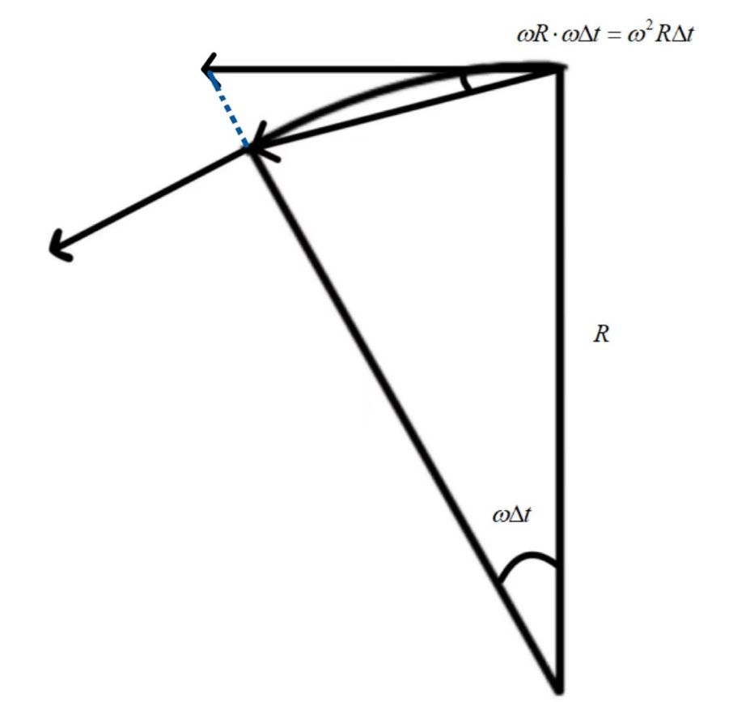

[回到主页面](index.html)

# 微分方程

[待补充]

> [!warning]
>
> ==李普希茨条件（Lipschitz Condition）==
>
> > ==定义==
> >
> > 一个函数 $f: \mathbb{R} \to \mathbb{R}$ 满足**李普希茨条件**，如果存在一个常数 $L \geq 0$，使得对于所有的 $x_1, x_2 \in \mathbb{R}$，都有：
> > $$
> > |f(x_1) - f(x_2)| \leq L |x_1 - x_2|
> > $$
> > 在这种情况下，我们称 $f$ 是一个 **李普希茨连续**（Lipschitz continuous）的函数，$L$ 被称为**李普希茨常数**。
>
> > ==结论==
> >
> > 一个函数 $f: \mathbb{R} \to \mathbb{R}$ 满足**李普希茨条件**，如果存在一个常数 $L \geq 0$，使得对于所有的 $x_1, x_2 \in \mathbb{R}$，都有：
> > $$
> > |f(x_1) - f(x_2)| \leq L |x_1 - x_2|
> > $$
> > 在这种情况下，我们称 $f$ 是一个 **李普希茨连续**（Lipschitz continuous）的函数，$L$ 被称为**李普希茨常数**。
>
> > ==意义==
> >
> > 李普希茨条件限制了函数在其定义域内的变化速度，保证了函数不会在任意小的区域内有过大的变化。如果一个函数是李普希茨连续的，那么它也是连续的，但反过来不一定成立。即，所有李普希茨连续函数都是连续函数，但并不是所有连续函数都是李普希茨连续的。
>
> > ==示例==
> >
> > 1. **线性函数**：$f(x) = kx + b$，其中 $k$ 是常数。这个函数是李普希茨连续的，李普希茨常数为 $|k|$。
> > 2. **绝对值函数**：$f(x) = |x|$ 是李普希茨连续的，李普希茨常数为 $1$。
> > 3. **非李普希茨函数**：例如，$f(x) = x^2$ 在整个实数集上不是李普希茨连续的，因为在无穷大处，函数的增长速度无限制。

# 多元微分
#### 几何应用
>[!important]
>**一、向量函数的导数**
>==**一元向量值函数**==
>设数集 $D \subseteq \mathbb{R}$，若映射：$ \mathbf{f}: D \to \mathbb{R}^n $
>则称 $\mathbf{f}$ 为**一元向量值函数**，记作：$ \mathbf{r} = \mathbf{f}(t), \quad t \in D $
>
>- $D$：函数的定义域
>- $t$：自变量（标量）
>- $\mathbf{r}$：因变量（$n$维向量）
>
>==**向量值函数的极限**==  
>设向量值函数 $\mathbf{f}(t)$ 在点 $t_0$ 的某去心邻域内有定义。若存在常向量 $\mathbf{r}_0$ 满足：
>
>$\forall \varepsilon > 0,\ \exists \delta > 0$，当 $0 < |t - t_0| < \delta$ 时，有
>$$ \|\mathbf{f}(t) - \mathbf{r}_0\| < \varepsilon $$
>
>则称 $\mathbf{r}_0$ 为 $\mathbf{f}(t)$ 当 $t \to t_0$ 时的**极限**，记作：$ \lim_{t \to t_0} \mathbf{f}(t) = \mathbf{r}_0 $ 或 $ \mathbf{f}(t) \to \mathbf{r}_0 \quad (t \to t_0) $
>
>**向量值函数导数的几何与物理意义**
>==几何解释==  
>设空间曲线 $\Gamma$ 是向量值函数 $\mathbf{r} = \mathbf{f}(t)$ 的终端曲线，取点：
>- $M$: $\overrightarrow{OM} = \mathbf{f}(t_0)$  
>- $N$: $\overrightarrow{ON} = \mathbf{f}(t_0 + \Delta t)$  
>
>当 $\mathbf{f}'(t_0) \neq \mathbf{0}$ 时：
>1. $\Delta t > 0$ 时，增量向量 $\Delta\mathbf{r} = \mathbf{f}(t_0+\Delta t) - \mathbf{f}(t_0)$ 与 $t$ 增长方向相同
>2. $\Delta t < 0$ 时，$\Delta\mathbf{r}$ 与 $t$ 增长方向相反
>3. **导数本质**：$\mathbf{f}'(t_0) = \lim\limits_{\Delta t \to 0} \frac{\Delta\mathbf{r}}{\Delta t}$ 始终指向 $t$ 增长方向，是曲线 $\Gamma$ 在 $M$ 点的**切向量**
>==物理意义（质点运动）==  
>若 $\mathbf{r} = \mathbf{f}(t)$ 表示运动质点的位置向量：
>- **速度向量**：  
>  $$ \mathbf{v}(t) = \frac{d\mathbf{r}}{dt} $$  
>   方向沿曲线切线方向
>- **加速度向量**：  
>  $$ \mathbf{a}(t) = \frac{d\mathbf{v}}{dt} = \frac{d^2\mathbf{r}}{dt^2} $$  
>   描述速度变化率
>
>
>
>**分量形式表示**
>向量函数对参数的导数：
>$$ \frac{d\vec{x}(t)}{dt} = \begin{pmatrix} \frac{dx(t)}{dt} \\ \frac{dy(t)}{dt} \\ \frac{dz(t)}{dt} \end{pmatrix} $$
>
>**运动学示例**
>1. 位置向量：
>$$ \vec{x}(t) = \begin{pmatrix} V_0 t \\ \frac{1}{2}gt^2 \end{pmatrix} $$
>
>2. 速度向量（一阶导）：
>$$ \dot{\vec{x}}(t) = \begin{pmatrix} V_0 \\ gt \end{pmatrix} $$
>
>3. 加速度向量（二阶导）：
>$$ \ddot{\vec{x}}(t) = \begin{pmatrix} 0 \\ g \end{pmatrix} $$
>
>==**二、几何形式**==
>匀速圆周运动的几何分析
>
>**向心加速度推导**
>加速度大小：$ a = \omega^2 R $，方向始终指向圆心
>
>==**三、运动学关系**==[这里没看懂在写什么，待补充]
>**速度与加速度**  
> 速度向量：$ \dot{\gamma}(t) = \frac{d\vec{r}}{dt} = \vec{v}(t) $
> 加速度向量：$ \ddot{\gamma}(t) = \frac{d^2\vec{r}}{dt^2} = \vec{a}(t) $
>**单位向量分解**  
>速度的单位向量表示：$ \dot{\gamma}(t) = \dot{\gamma}(t) \cdot \hat{\gamma}(t) $
>其中 $\hat{\gamma}(t)$ 为单位方向向量
>位置向量的微分：$ \frac{d\vec{r}(t)}{dt} = \frac{d\gamma(t)}{dt} \cdot \hat{\gamma}(t) + \gamma(t)\frac{d\hat{\gamma}(t)}{dt} $
>**极坐标表示**  
>单位向量的微分：$ \frac{d\hat{\gamma}(t)}{dt} = \dot{\gamma}\hat{\theta} + \gamma\dot{\theta}(-\hat{\gamma}) $
>极坐标参数：$ (\gamma, \theta) $
> 微分关系： $ d\hat{\gamma} = \gamma\dot{\theta}\hat{\theta} $
> 向量恒等式：$ \hat{\gamma} \times \hat{\theta} = -\hat{\gamma} \cdot \gamma\dot{\theta} \cdot \hat{\theta} $
>

>[!note]
>
> >==例1==
> >
> >**设向量值函数：$ \mathbf{f}(t) = (\cos t)\mathbf{i} + (\sin t)\mathbf{j} + t\mathbf{k} $ , 求极限 $\lim\limits_{t \to \frac{\pi}{4}} \mathbf{f}(t)$.**
> >
> >==解== 
> >分量式求极限：
> >$$\begin{aligned}
> >\lim_{t \to \frac{\pi}{4}} \mathbf{f}(t) &= \left( \lim_{t \to \frac{\pi}{4}} \cos t \right)\mathbf{i} + \left( \lim_{t \to \frac{\pi}{4}} \sin t \right)\mathbf{j} + \left( \lim_{t \to \frac{\pi}{4}} t \right)\mathbf{k} \\
> >&= \frac{\sqrt{2}}{2}\mathbf{i} + \frac{\sqrt{2}}{2}\mathbf{j} + \frac{\pi}{4}\mathbf{k}
> >\end{aligned}$$
>
>
> > ==例2==
> > 
> >**设空间曲线 $\Gamma$ 的向量方程为
> > $$ r = f(t) = (t^2 + 1, 4t - 3, 2t^2 - 6t), t \in \mathbb{R}, $$
> > 求曲线 $\Gamma$ 在与 $t = 2$ 相应的点处的单位切向量.**
> > 
> > ==解== 
> > $$ f'(t) = (2t, 4, 4t - 6), t \in \mathbb{R}, $$ 
> > $$ f'(2) = (4, 4, 2), $$ 
> > $$ |f'(2)| = \sqrt{4^2 + 4^2 + 2^2} = 6. $$
> > 由导向量的几何意义知，曲线 $\Gamma$ 在与 $t = 2$ 相应的点处的一个单位切向量是 $\left( \frac{2}{3}, \frac{2}{3}, \frac{1}{3} \right)$，其指向与 $t$ 的增长方向一致；另一个单位切向量是 $\left( -\frac{2}{3}, -\frac{2}{3}, -\frac{1}{3} \right)$，其指向与 $t$ 的增长方向相反。
>
>
> >==例3==
> >
> >**一个人在悬挂式滑翔机上由于快速上升气流而沿位置向量为 $r = f(t) = (3\cos t)i + (3\sin t)j + t^2k$ 的路径螺旋式向上.求
> >（1）滑翔机在任意时刻 $t$ 的速度向量和加速度向量；
> >（2）滑翔机在任意时刻 $t$ 的速率；
> >（3）滑翔机的加速度与速度正交的时刻.**
> >
> >==解== 
> >（1） 
> >$$ r = f(t) = (3\cos t)i + (3\sin t)j + t^2k, $$ 
> >$$ v = \frac{dr}{dt} = (-3\sin t)i + (3\cos t)j + 2tk, $$ 
> >$$ a = \frac{d^2r}{dt^2} = (-3\cos t)i - (3\sin t)j + 2k. $$
> >（2）速率是速度的大小，即 
> >$$ |v| = \sqrt{(-3\sin t)^2 + (3\cos t)^2 + (2t)^2} = \sqrt{9 + 4t^2}. $$
> >这一结果表明：滑翔机沿其路径升高时，运动得越来越快。
> >（3）由 $v \cdot a = 9\sin t \cos t - 9\sin t \cos t + 4t = 0$，得 $t = 0$。这表明：加速度与速度正交的唯一时刻是在 $t = 0$.
### 空间曲线的切线与法平面

>[!important]
>==参数曲线定义==
> 设空间曲线 $\Gamma$ 的参数方程为：
> $$ \begin{cases} 
> x = \varphi(t) \\ 
> y = \psi(t) \quad t \in [\alpha, \beta] \\ 
> z = \omega(t) 
> \end{cases} $$
> 其中 $\varphi(t), \psi(t), \omega(t)$ 在 $[\alpha, \beta]$ 上可导且导数不同时为零.
> ==切向量与切线方程==
> 对于曲线上点 $M(x_0,y_0,z_0)$（对应参数 $t_0$），定义向量值函数：
> $$ \mathbf{f}(t) = (\varphi(t), \psi(t), \omega(t)) $$
> ==切向量==：
> $$ \mathbf{T} = \mathbf{f}'(t_0) = (\varphi'(t_0), \psi'(t_0), \omega'(t_0)) $$
> ==切线方程==（对称式）：
> $$ { \frac{x-x_0}{\varphi'(t_0)} = \frac{y-y_0}{\psi'(t_0)} = \frac{z-z_0}{\omega'(t_0)} } $$
> ==法平面方程==
> 法平面是以 $\mathbf{T}$ 为法向量且通过 $M$ 点的平面：
> $$ { \varphi'(t_0)(x-x_0) + \psi'(t_0)(y-y_0) + \omega'(t_0)(z-z_0) = 0 }$$

>[!note]
>
> >==例==
> >
> >**求曲线 $x^2 + y^2 + z^2 = 6$, $x + y + z = 0$ 在点 $(1, -2, 1)$ 处的切线及法平面方程.**
> >
> >==解:==将所给方程的两边对 $x$ 求导并移项，得
> >$$ \begin{cases}
> >y \frac{dy}{dx} + z \frac{dz}{dx} = -x, \\
> >\frac{dy}{dx} + \frac{dz}{dx} = -1.
> >\end{cases}$$
> >由此得
> >$$ \frac{dy}{dx} = \frac{z - x}{y - z}, \quad \frac{dz}{dx} = \frac{x - y}{y - z}.$$
> >从而$$
> >\frac{dy}{dx} \bigg|_{(1,-2,1)} = 0, \quad \frac{dz}{dx} \bigg|_{(1,-2,1)} = -1.
> >$$ 故所求切线方程为$$
> >\frac{x - 1}{1} = \frac{y + 2}{0} = \frac{z - 1}{-1},
> >$$法平面方程为
> >$$(x - 1) + 0 \cdot (y + 2) - (z - 1) = 0,
> >$$即 $x - z = 0.$

### 曲面的切平面和法线

>[!important]
> **给定曲面**  
> 设曲面Σ的方程为 $F(x,y,z) = 0$，点 $M(x_0,y_0,z_0)$ 在曲面上
>==**法向量确定**==  
> 若 $F$ 在点 $M$ 处可微，且梯度 $\nabla F \neq \mathbf{0}$，则：
> $$\mathbf{n} = (F_x(x_0,y_0,z_0),\ F_y(x_0,y_0,z_0),\ F_z(x_0,y_0,z_0))$$
> ==**切平面方程**==  
> $${F_x(x_0,y_0,z_0)(x-x_0) + F_y(x_0,y_0,z_0)(y-y_0) + F_z(x_0,y_0,z_0)(z-z_0) = 0}$$
> ==**法线方程**==  
> $${\frac{x-x_0}{F_x(x_0,y_0,z_0)} = \frac{y-y_0}{F_y(x_0,y_0,z_0)} = \frac{z-z_0}{F_z(x_0,y_0,z_0)}}$$
> ==**显式曲面特殊情况**==  
> 当曲面为 $z=f(x,y)$ 时：
> - 法向量：$\mathbf{n} = (f_x(x_0,y_0),\ f_y(x_0,y_0),\ -1)$
> - 切平面方程：
> $${z-z_0 = f_x(x_0,y_0)(x-x_0) + f_y(x_0,y_0)(y-y_0)}$$

>[!note]
> >==例1==
> >
> >**求球面 $x^2 + y^2 + z^2 = 14$ 在点 $(1,2,3)$ 处的切平面及法线方程.**
> >
> >==解== 
> >设 $F(x,y,z) = x^2 + y^2 + z^2 - 14$，则法向量：$ \mathbf{n} = (F_x, F_y, F_z) = (2x, 2y, 2z) $
> >在点 $(1,2,3)$ 处：$ \mathbf{n} \big|_{(1,2,3)} = (2,4,6) $
> >**切平面方程**  
> >$ 2(x-1) + 4(y-2) + 6(z-3) = 0 $
> >化简得：$ x + 2y + 3z - 14 = 0 $
> >**法线方程**  
> >对称式：$ \frac{x-1}{1} = \frac{y-2}{2} = \frac{z-3}{3} $
> >或等价表示为：$ \frac{x}{1} = \frac{y}{2} = \frac{z}{3} $
> 法线通过原点/球心
>
>
> >==例2==
> >
> > **求旋转抛物面 $z = x^2 + y^2 - 1$ 在点 $(2,1,4)$ 处的切平面及法线方程.**
> >
> > ==解==
> > $ f(x,y) = x^2 + y^2 - 1, $
> > $ n = (f_x, f_y, -1) = (2x, 2y, -1), $
> > $ n|_{(2,1,4)} = (4, 2, -1). $
> > 所以在点 $(2,1,4)$ 处的切平面方程为
> > $ 4(x-2) + 2(y-1) - (z-4) = 0. $
> > 即 $ 4x + 2y - z - 6 = 0. $
> > 法线方程为
> > $ \frac{x-2}{4} = \frac{y-1}{2} = \frac{z-4}{-1}. $

[回到主页面](index.html)